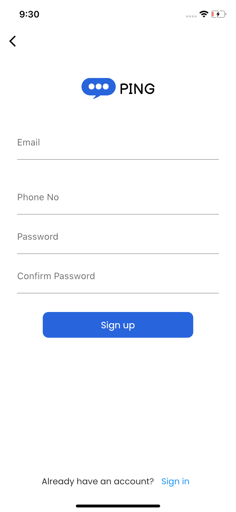
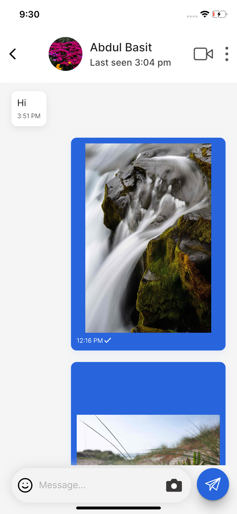
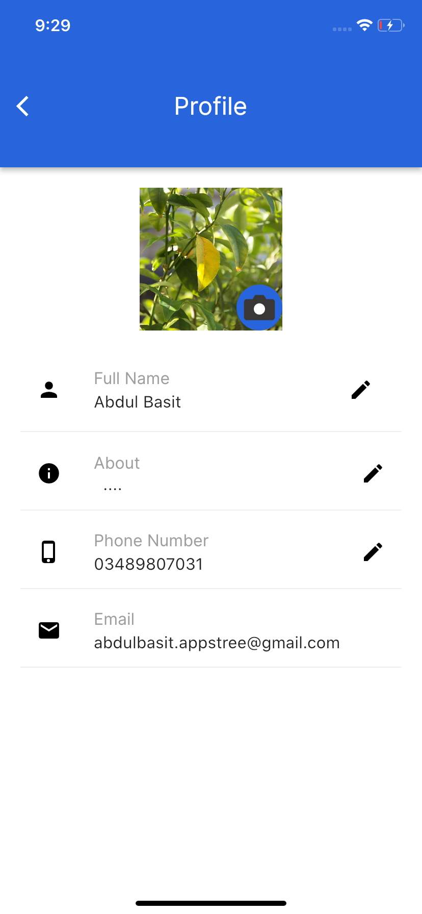
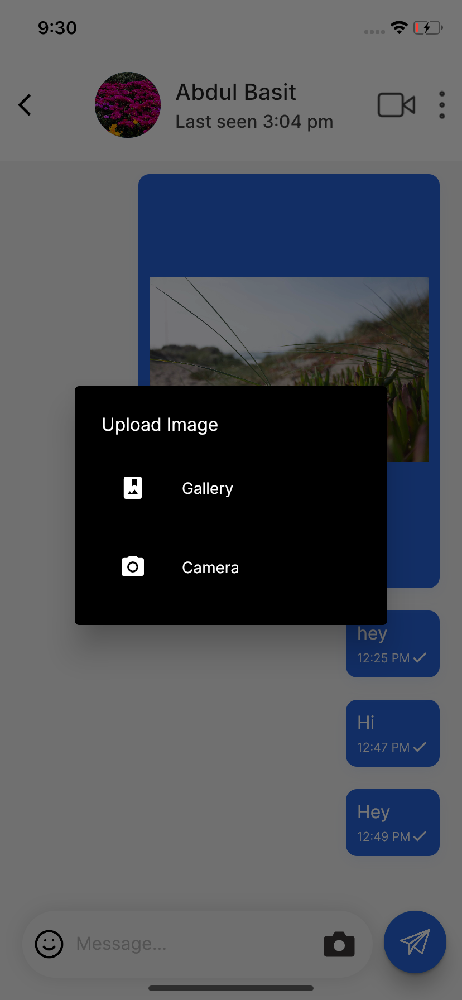

# Chat App with Firebase

The UI of this chat app is developed in flutter and designed in figma. The app includes main page where chat rooms are present of user also there is profile page, login page etc.

The app design was taken from this figma design file.

https://www.figma.com/file/10G6zbwg91v7VEyn3jHIHY/Ping-Chat-App-(Community)?node-id=11%3A167&t=Cxirxsdvq7OSWpVT-0

# Video

# Screenshots

    .   

         

&nbsp;

# App Overview

Ping is a chat application developed in flutter for both android and ios users. The app contains major login methods like login with email, phone and google also users can signup and complete their user profile. After loging in they reach home screen where they see already open chatroom with other users if any. There is a profile page to see current info and also edit it. The main chat page is also functional and has features like sending texts,emojis and image files from gallery and camera as well. The chats work in realtime as firebase is used for backend and storage of our app. Users can also signout and select who they want to chat.

# Future Work

In future we have plans to add video and audio calls feature. File sending like pdfs, word to also be added. Searching to be implemented and blocking and deleting options as well are planned in future.
